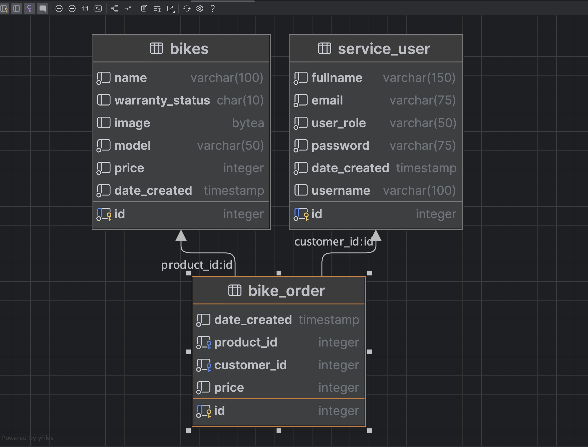

# Pedal E-Commerce Project

This project was developed using the following technologies; 

- Java 
- Spring Boot
- Thymeleaf rendering engine
- PostgresQL
- SQL Server
- TailwindCSS

## To Run: 

Ensure you the data requirements settled, then use the `mvnw` bin or IntelliJ runner to start the application.

### Database
The bike_commerce application uses two databases; 

The SQL Server database should have the following table;
* `employees` table for storing employees data 

The postgresql database should have the following tables;

* bikes
* service_user
* bike_order

# Data Requirements;

This application uses PostgresQL and SQL Server databases with their datasources configured in the `com.example.bike_commerce.configuration` package. To connect with the databases, the `application.properties` file should have the following properties;
Ensure to replace the placeholders in the angle brackets 

```yml
# POSTGRES DATABASE
spring.jpa.properties.hibernate.jdbc.lob.non_contextual_creation=true
spring.datasource.customers.url=<POSTGRES_DB_URL>
spring.datasource.customers.username=<POSTGRES_DB_USERNAME>
spring.datasource.customers.password=<POSTGRES_DB_PASSWORD>

# SQL SERVER DATABASE
spring.datasource.employees.url=<SQL_SERVER_URL>
spring.datasource.employees.username=<SQL_SERVER_USERNAME>
spring.datasource.employees.password=<SQL_SERVER_PASSWORD>
spring.jpa.database-platform=org.hibernate.dialect.SQLServerDialect
```

The `./ebike_data.sql` file contains SQL statements to create the columns within the aforementioned tables. 
The image below also shows the data diagram;

